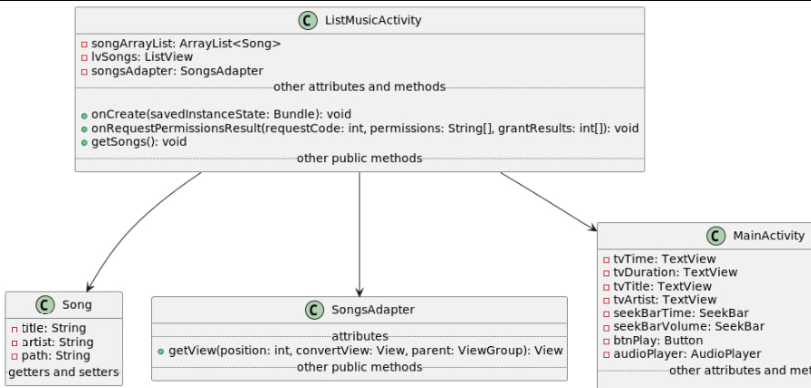

# Проект MusicPlayer на Java
Автор: Сергей Булыкин КИ22-16\1б
## Описание
Этот проект был выполнен в рамках курса "Проектирование программного обеспечения". Он представляет собой простейший музыкальный плеер для андроид 14
под экран Galaxy S23 Ultra (3088х1440)


## Запуск   
**Для запуска нужен Android Studio**
   Перейдите в Android Studio, нажмите build, затем на кнопочку запуска, дальше выберите в эмулируемом устройстве приложение. Разрешите доступ к памяти, когда оно запросит
   и вам откроется список ваших песен. Выберите любой трек и слушайте. Если хотите выбрать другой трек - приостановите воспроизведение и вернитесь обратно к списку песен.

## Соблюдение принципов SOLID

## 1. ListMusicActivity:

   * Single Responsibility Principle: Этот класс отвечает за отображение списка музыкальных композиций и запрос разрешения. В целом, этот принцип соблюдается.
    
   * Open/Closed Principle: Класс не предоставляет явных методов для расширения, но если в будущем потребуется добавить новую функциональность 
    (например, фильтрация или сортировка), это может потребовать изменения в коде. Так что этот принцип может быть не полностью соблюден.
    
   * Liskov Substitution Principle: Этот принцип касается подтипов и их совместимости с базовым типом. В данном контексте не совсем применим, 
    так как это активность Android, но в целом класс работает с коллекцией Song, и с этой точки зрения, принцип подстановки Лисков соблюдается.

   * Interface Segregation Principle: Не применим в данном контексте, так как нет явных интерфейсов.
    
   * Dependency Inversion Principle: Класс ListMusicActivity зависит от Song, Intent, ActivityCompat, и других системных классов, что вполне нормально для Android-активности.

## 2. MainActivity:

  * Single Responsibility Principle: Этот класс отвечает за управление воспроизведением музыки и обновление интерфейса. В целом, принцип соблюдается.

  * Open/Closed Principle: Как и в предыдущем случае, возможно, потребуется изменение кода для добавления новых функций.

  * Liskov Substitution Principle: Класс работает с объектами Song, и этот принцип соблюдается.

  * Interface Segregation Principle: Не применим в данном контексте.

  * Dependency Inversion Principle: MainActivity зависит от Android-компонентов и класса Song, что вполне нормально для Android-активности.

## 3. Song:

  * Single Responsibility Principle: Класс представляет музыкальную композицию и соблюдает принцип единственной ответственности.

  * Open/Closed Principle: Класс не раскрывает свою реализацию и может быть расширен путем добавления новых полей или методов.

  * Liskov Substitution Principle: В данном контексте принцип не совсем применим, так как Song представляет данные и не имеет подтипов.

  * Interface Segregation Principle: Не применим, так как Song не реализует интерфейсы.

  * Dependency Inversion Principle: Класс не содержит зависимостей, которые могли бы нарушить принцип инверсии зависимостей.

## 4. SongsAdapter:

  * Single Responsibility Principle: Адаптер отвечает за преобразование данных музыкальных композиций в элементы интерфейса списка. Принцип соблюдается.

  * Open/Closed Principle: Адаптер может быть расширен для изменения визуального представления элементов списка без изменения его кода. Принцип соблюдается.

  * Liskov Substitution Principle: Принцип подстановки Лисков в данном контексте не совсем применим, так как SongsAdapter предназначен для работы с объектами Song, и это не подтипы.

  * Interface Segregation Principle: Не применим, так как SongsAdapter не реализует интерфейсы.

  * Dependency Inversion Principle: Адаптер зависит от ArrayAdapter и Song, что является нормальной практикой для адаптера.

## 5. AudioPlayer:

  * Single Responsibility Principle: Интерфейс определяет методы для управления аудиоплеером, что соблюдает принцип единственной ответственности.

  * Open/Closed Principle: Так как это интерфейс, он может быть легко расширен новыми методами, не затрагивая существующий код. Принцип соблюдается.

  * Liskov Substitution Principle: Принцип подстановки Лисков соблюдается, так как классы, реализующие этот интерфейс, могут быть безопасно использованы вместе.

  * Interface Segregation Principle: Интерфейс довольно компактен и не содержит избыточных методов, поэтому принцип разделения интерфейса не является актуальным в данном контексте.

  * Dependency Inversion Principle: Интерфейс не зависит от конкретных реализаций, что соответствует принципу инверсии зависимостей.

## 6. MediaPlayerWrapper:

  * Single Responsibility Principle: Класс управляет MediaPlayer и обертывает его функциональность, что соблюдает принцип единственной ответственности.

  * Open/Closed Principle: Класс можно расширить для добавления новых функций без изменения существующего кода. Принцип соблюдается.

  * Liskov Substitution Principle: Класс предоставляет функциональность, которая ожидается от объекта, реализующего AudioPlayer. Принцип соблюдается.

  * Interface Segregation Principle: Класс реализует полностью функциональный интерфейс, соответствующий принципу разделения интерфейса.

  * Dependency Inversion Principle: MediaPlayerWrapper зависит от MediaPlayer, что является нормальным для класса, который оборачивает функциональность другого класса.
    
## Паттерн Фасад

  ### Описание применения:
   ListMusicActivity выступает в роли фасада, предоставляя упрощенный интерфейс для работы с музыкальными данными.
  ### Причины использования:
   Пользовательскому интерфейсу (UI) и аудиоплееру требуется взаимодействие с различными компонентами, такими как получение разрешений, чтение музыкальных данных, управление воспроизведением и т.д.
   ListMusicActivity скрывает сложность взаимодействия с этими компонентами, предоставляя простой интерфейс для получения списка песен и перехода к воспроизведению.

```java
  @Override
    protected void onCreate(Bundle savedInstanceState) {
        super.onCreate(savedInstanceState);
        setContentView(R.layout.activity_list_music);
        lvSongs = findViewById(R.id.lvSongs);
        songArrayList = new ArrayList<>();
        this.songsAdapter = new SongsAdapter(this, songArrayList);

        lvSongs.setAdapter(songsAdapter);
        if (ActivityCompat.checkSelfPermission(this, Manifest.permission.READ_MEDIA_AUDIO) != PackageManager.PERMISSION_GRANTED) {
            ActivityCompat.requestPermissions(this, new String[]{Manifest.permission.READ_MEDIA_AUDIO}, REQUEST_PERMISSION);
        } else {
            getSongs();
        }
        lvSongs.setOnItemClickListener((parent, view, position, id) -> {
            Song song = songArrayList.get(position);
            Intent openMusicPlayer = new Intent(ListMusicActivity.this, MainActivity.class);
            openMusicPlayer.putExtra("song", song);
            startActivity(openMusicPlayer);
        });
    }

    private void getSongs() {
        // Логика получения списка песен
        ContentResolver contentResolver = getContentResolver();
        Uri songUri = MediaStore.Audio.Media.EXTERNAL_CONTENT_URI;
        Cursor songCursor = contentResolver.query(songUri, null, null, null, null);
        if (songCursor != null && songCursor.moveToFirst()) {
            int indexTitle = songCursor.getColumnIndex(MediaStore.Audio.Media.TITLE);
            int indexArtist = songCursor.getColumnIndex(MediaStore.Audio.Media.ARTIST);
            int indexData = songCursor.getColumnIndex(MediaStore.Audio.Media.DATA);

            do {
                String title = songCursor.getString(indexTitle);
                String artist = songCursor.getString(indexArtist);
                String path = songCursor.getString(indexData);

                songArrayList.add(new Song(title, artist, path));

            } while (songCursor.moveToNext());
        }
        songsAdapter.notifyDataSetChanged();
    }
```
В данном коде ListMusicActivity выполняет роль фасада, управляя процессом получения разрешений, чтения данных о музыке и отображения списка песен.
Остальные компоненты (например, MainActivity) взаимодействуют с ListMusicActivity, не беспокоясь о деталях реализации этих процессов.




## Паттерн, который не стоило бы применять: 

Паттерн "Одиночка" (Singleton) точно не был бы оптимальным выбором для данного приложения. Паттерн "Одиночка" используется, когда требуется, чтобы у 
класса был только один экземпляр, и к этому экземпляру предоставляется глобальная точка доступа.

в данном случае нет необходимости в гарантированном наличии только одного экземпляра какого-либо класса, и нет необходимости в глобальной точке доступа к этому экземпляру.
Напротив, у вас есть несколько экземпляров различных классов, таких как ListMusicActivity, MainActivity, и AudioPlayer, и они взаимодействуют друг с другом.

Таким образом, паттерн "Одиночка" был бы избыточным и неудачным выбором в данном контексте.


